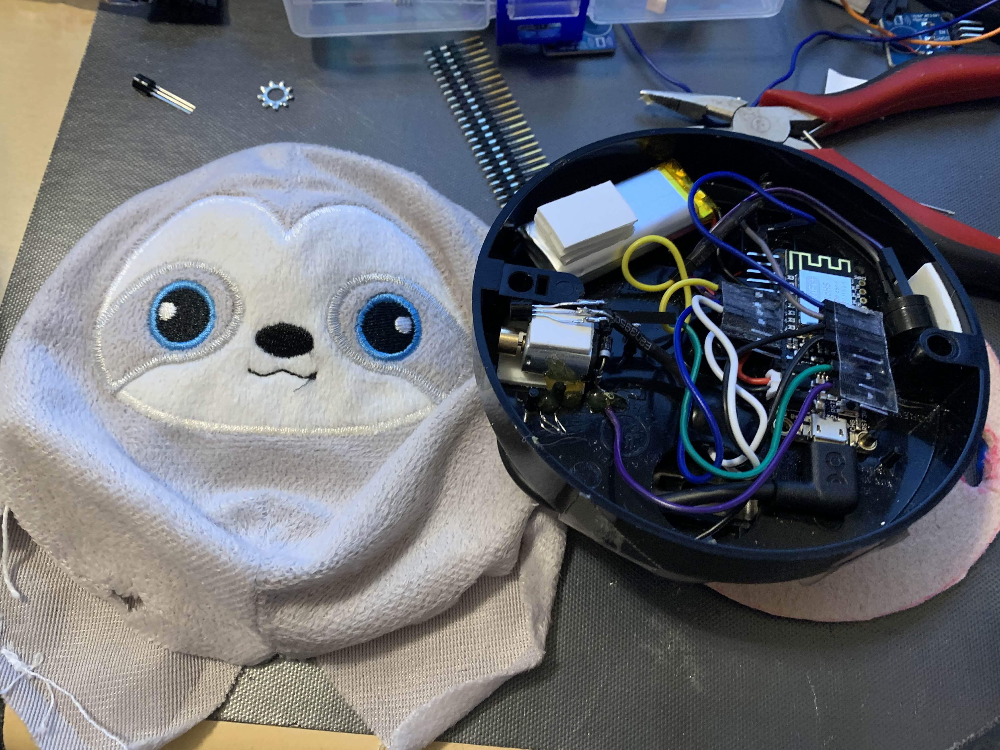

# Talk and Toss

**Talk and Toss** is a small, simple device for timing introductions in group settings. Press the button, and a 30-second timer starts. When the time is up, the device vibrates, indicating it's time to pass it to the next person.

## Features

- **30-Second Timer:** Starts with a button press.
- **Vibration Alert:** Signals when the timer ends.
- **Portable Design:** Easy to use in any group setting.

## Hardware

> **Warning**
> This is a prototype build. Components and configurations are subject to change after initial testing.

- **Microcontroller**: [Feather Huzzah](https://www.adafruit.com/product/2821) (chosen for onboard battery charging)
- **Button**: Simple momentary push-button to start the timer.
- **Power Switch**: Toggle switch for easy on/off control.
- **Vibration Motor**: Provides tactile feedback when the timer ends.
  - **Driver**: 2N2222 transistor with a 220Ω base resistor and a flyback diode.
- **LED**: Visual indicator with a current-limiting resistor.
- **Speaker**: Piezo speaker for sound alerts.
- **Battery**: LiPo battery for portability.
- **Enclosure**: Compact project case to house the components.
- **USB Cable**: Short USB cable for charging and programming.

## Future Plans

- **Streamlined Parts**: Simplify and standardize the parts list.
- **3D Printed Case**: Create a custom enclosure to house everything securely.
- **Set Timer Easily**: Allow users to adjust the timer without needing to reprogram.
